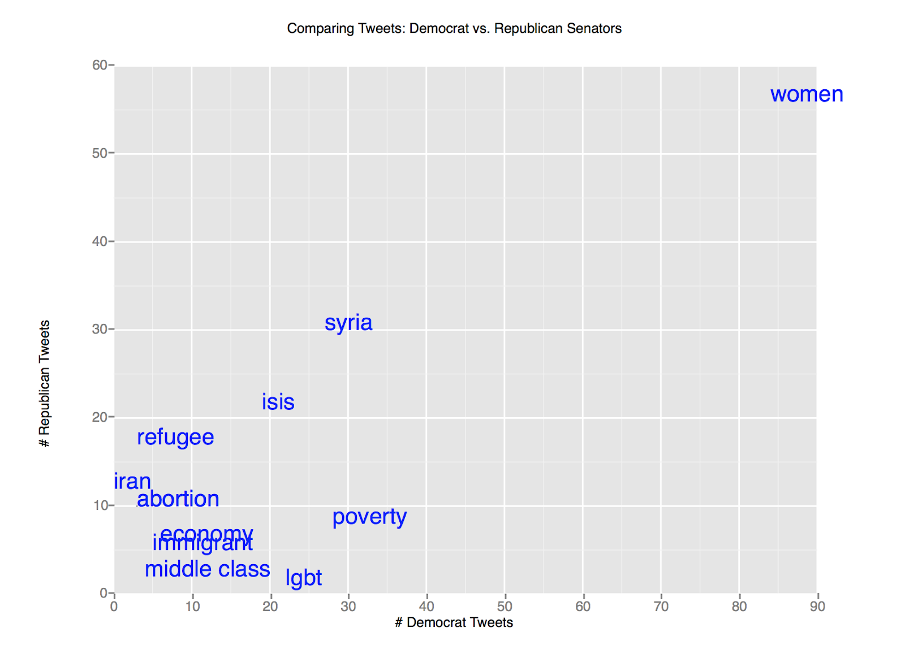

# Twitter NLP Project
### Visualizing bipartisan senator tweets using NLP
### SI 330 Final Project
Khyatee Desai

# Background
This script allows the user to input a keyword that they would like to search on twitter. A cache of all US Senators’ tweets is then parsed for the keyword, and the count frequency is recorded. This count frequency is then displayed on a plot, visualizing how many times Republican vs. Democratic senators have tweeted the given keyword. 
The purpose of this project is to directly compare the ways that different political parties engage with social media. I wanted to see what topics the two political parties tend to agree on, for instance, if both parties tend to have a similar tweet frequency for certain words. Conversely, I also wanted to learn about which topics are highly polarized between parties: keywords about religion, diversity, the environment, and marginalized groups. 

# Data Sources

The two data sources I used for this project are an HTML response retrieved from [Ballotpedia.org](https://ballotpedia.org/List_of_current_members_of_the_U.S._Congress) through webscraping, and a JSON response from the [Twitter Search API](https://developer.twitter.com/en/docs) The HTML response is cached in the document “step1.html” and contains the names of all current US Senators, while the Twitter API is used to search for each Senator's twitter account and retrieve their tweets.

# Data Processing Steps
The script is divided into six consecutive steps, commented into the code: 
In Step 1, an HTML response is retrieved from ballotpedia.org using the requests module. This response is then cached into “step1.html.” Next, BeautifulSoup is used to parse through the HTML and retrieve a list of tuples (the output of this step.) Each tuple contains the name of a current senator, and the name of their political party affiliation (i.e. (Bernie Sanders, Democratic).) 

In Step 2, the list of tuples is parsed using Regular Expressions to create two separate lists of senator names—one for Democrats, and one for Republicans. These lists are called “dems” and “repubs” respectively. 

Step 3 makes a request to the Twitter Search API for each name in the above two lists of senators. Then the JSON response is parsed to retrieve a twitter handle for each senator, which is then written to one of two text files (‘dem_handles.txt’ and ‘repub_handles.txt,’) delimited by commas. 

In Step 4, each of the cached twitter handles is sent through another Twitter Search API request, to retrieve each senator’s most recent 100 tweets. These tweets are saved to the text files ‘dem_tweets.txt’ and ‘repub_tweets.txt’. The files are then split into two lists using the split() function. Each of the two lists contains all of the tweets retrieved from either the Republican or Democratic senators. The two lists are ‘all_repub_tweets’ and ‘all_dem_tweets.’ 

Step 5 of the program asks the user to input a keyword that they would like to search. The lists of democrat and republican tweets are then searched for the keyword, and a count frequency is recorded for each. Then the keyword, the count frequency for the democrat tweets, and the count frequency for the republican tweets are recorded in a dictionary. This dictionary is appended to a list (lod) and the loop is repeated for another keyword, until the user hits “q.” 

Finally, Step 6 of the program creates a pandas data frame from the list of dictionaries (lod.) This object is then used to make a text-based plot using ggplot. The plot contains # Democrat Tweets on the X axis, and Republican Tweets on the Y axis. Each data point is represented by the text of the keyword that was searched, making the plot easy to understand and analyze.  

# Results
Most of the results from this program followed my predictions. Keywords that are typically more closely tied to and discussed within the Democratic party such as “lgbt,” “women,” and “poverty” had a much higher frequency among Democratic Senators. On the other hand, terms more closely tied to conservative conversations such as “abortion,” “Christian,” and “tradition” had a much higher tweet frequency among Republican Senators. 

Below is an example of a string of queries to the program with various keywords followed by their Tweet counts.  

Finally, here is the ggplot visualization of these queries. The terms in the plot appear blue if the majority of tweets came from Democratic senators, and red if they came from Republican senators.

# Conclusion
I am pleased with the outcome of this project. I think it was really interesting to pass random keywords into my program and see the sometimes surprising results. As a next step, I would love to include more politicians, such as House of Representative members as well. It could also be interesting to create a graph with nodes and edges to analyze the relationships between each of these politicians. 	
